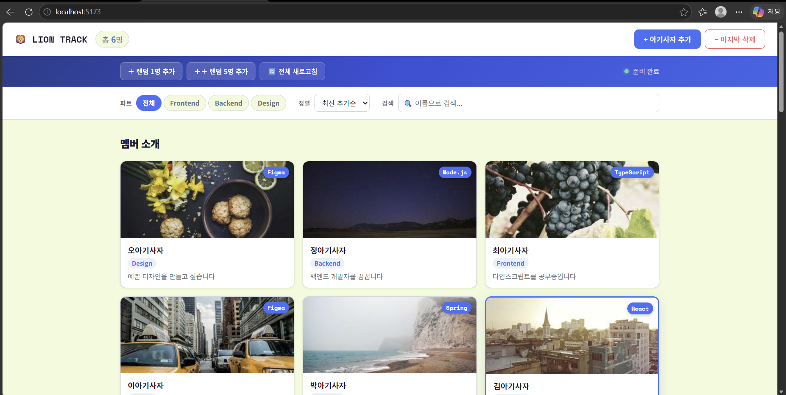
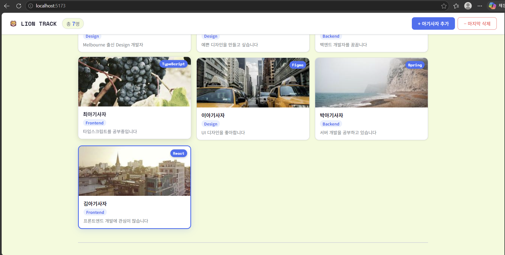
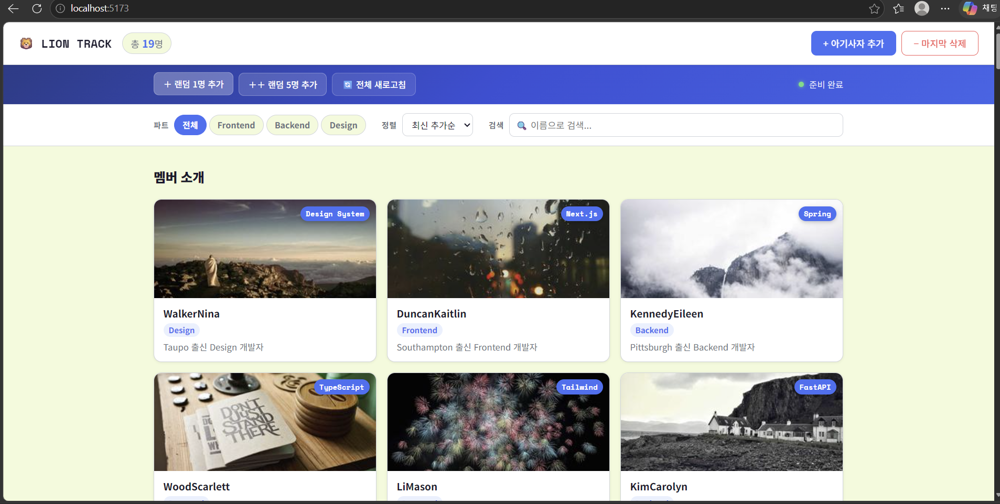
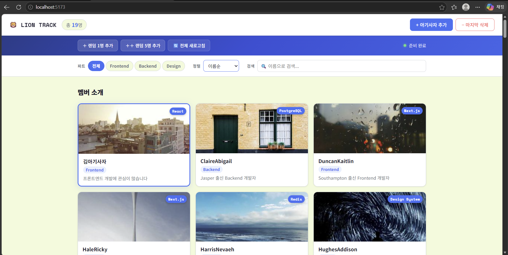
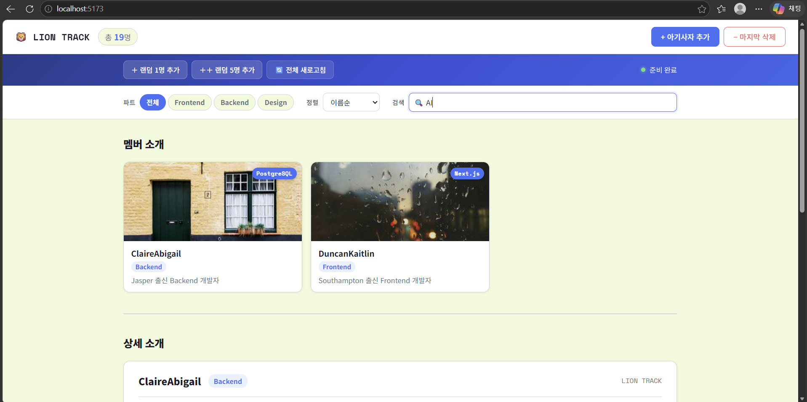
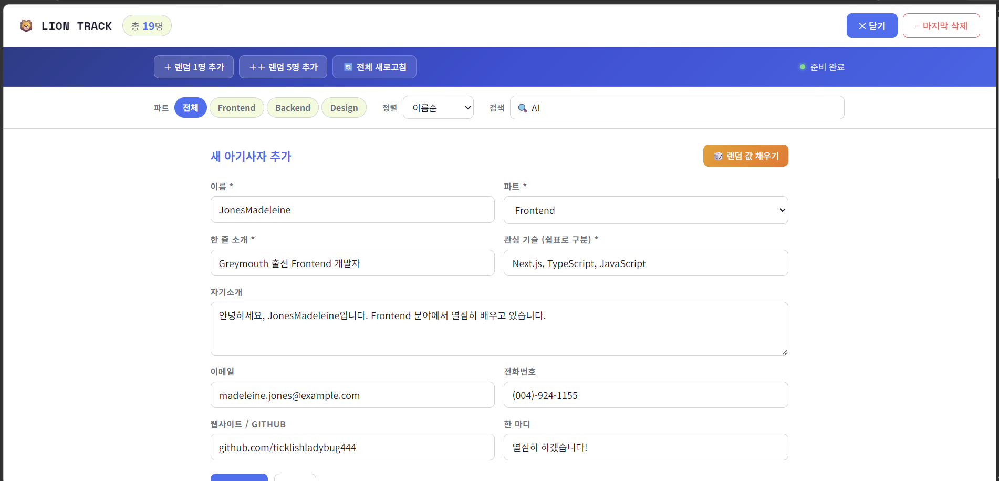

# 📘 Today I Learned

### 1. 오늘 배운 내용

- useState로 상태를 관리하고 상태가 바뀌면 화면이 자동으로 다시 렌더링되는 방식
- useEffect로 ESC 키 이벤트 등 렌더링과 분리된 사이드 이펙트 처리
- 관련 로직을 Custom Hook(useLions, useFetch, useViewOptions)으로 분리하는 방법
- 필터/정렬/검색 상태를 조합해 최종 화면을 결정하는 데이터 흐름

### 2. 핵심 정리 (내 언어로)

- useState는 값이 바뀌면 React가 알아서 화면을 다시 그려주는 특별한 변수다
- DOM을 직접 건드리지 않고 데이터(상태)만 바꾸면 화면이 자동으로 따라온다
- Custom Hook은 상태와 관련 함수를 한 파일에 묶어서 App.jsx가 복잡해지는 걸 막아준다
- 여러 상태(필터, 정렬, 검색어)가 합쳐져서 최종적으로 보여줄 목록이 결정된다

### 3. 결과 이미지(스크린샷)

- 초기 화면
  

- 랜덤 유저를 추가했을 때 (요약 정보 영역 하단)
  

- 19개의 데이터가 있는 상황에서 ‘전체 새로고침’을 클릭했을 때
  

- 이름순 정렬을 수행했을 때
  

- 검색 input에 ‘Al’을 입력했을 때
  

- 정보 입력 폼에서 ‘랜덤 값 채우기’를 눌러서 데이터를 불러왔을 때
  

### 4. 느낀 점

- DOM을 직접 조작하던 방식보다 상태만 바꾸는 방식이 훨씬 깔끔하다는 걸 느꼈다
- Custom Hook으로 분리하니 각 파일의 역할이 명확해져서 코드 읽기가 쉬워졌다
- 처음엔 props로 함수를 전달하는 게 복잡하게 느껴졌지만 흐름을 파악하니 이해됐다
