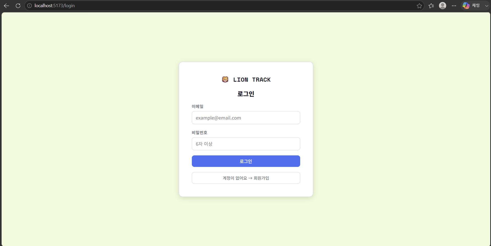
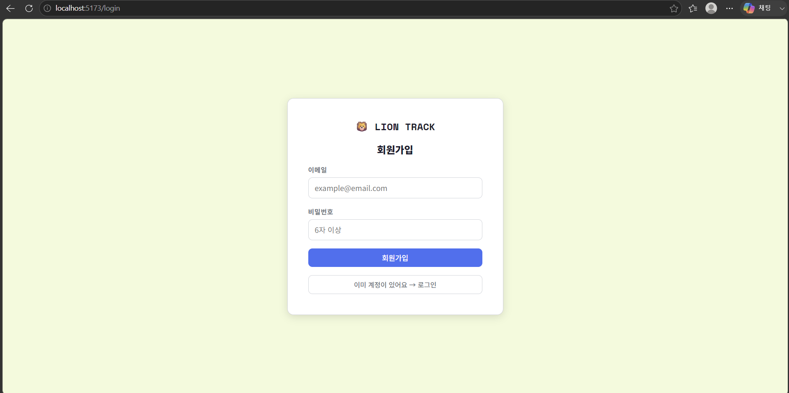
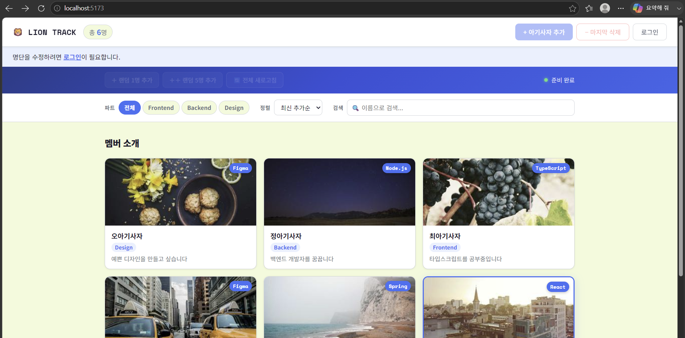
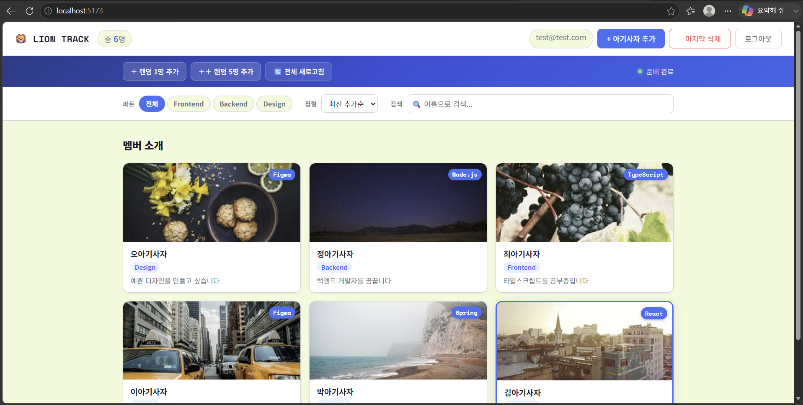
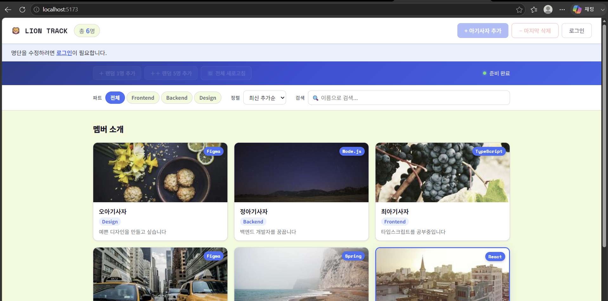
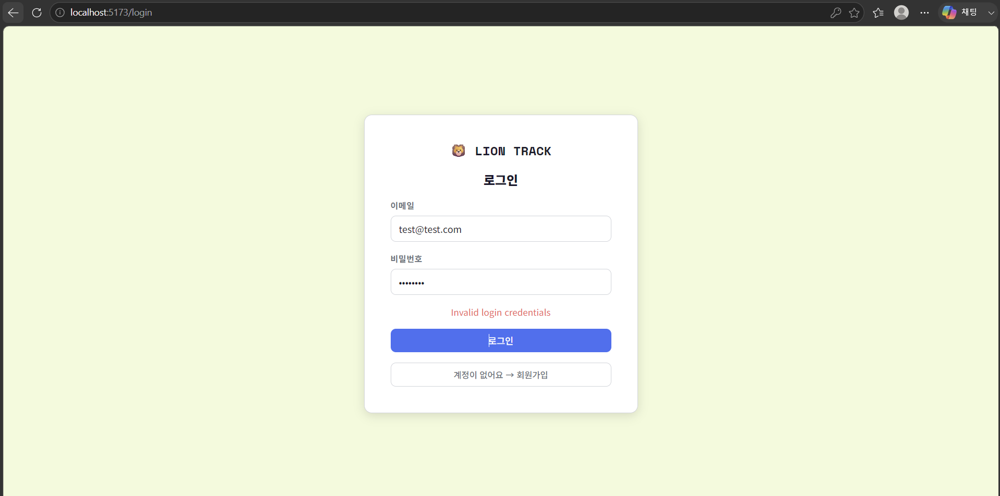
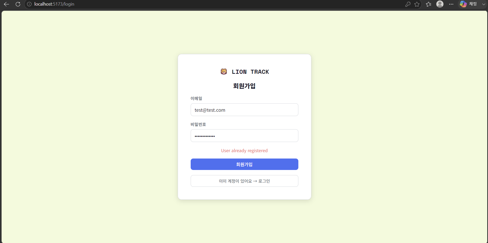
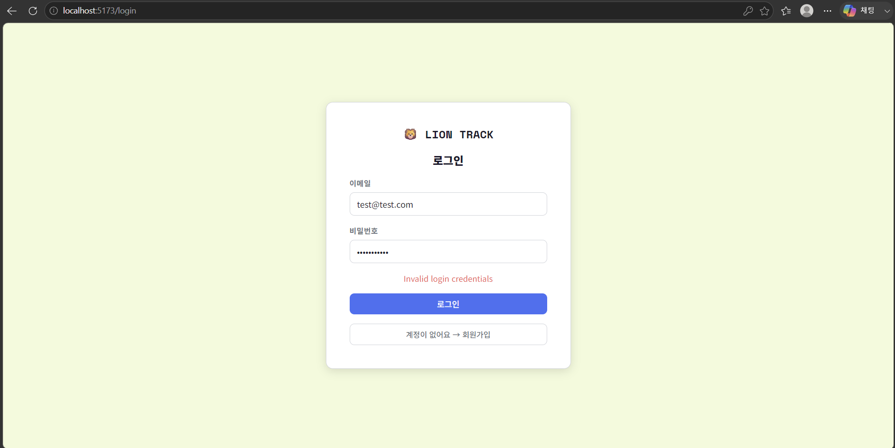

# 📘 Today I Learned

### 1. 오늘 배운 내용

- Supabase를 사용해 데이터베이스와 인증 기능을 구현하는 방법
- 환경 변수로 API 키를 안전하게 관리하는 방법
- Row Level Security(RLS)로 로그인한 사용자만 데이터를 수정하도록 권한을 설정하는 방법
- 이메일/비밀번호 기반 회원가입 및 로그인 흐름 구현

### 2. 핵심 정리 (내 언어로)

- 브라우저 메모리에만 저장하던 데이터를 Supabase DB에 저장하니 새로고침해도 데이터가 유지된다
- API 키는 .env.local에 넣고 .gitignore에 추가해서 Git에 올라가지 않도록 관리한다
- RLS 정책으로 조회는 누구나, 추가/삭제는 로그인한 사용자만 가능하도록 설정했다
- BaaS를 쓰면 별도의 백엔드 서버 없이 프론트엔드에서 직접 DB를 읽고 쓸 수 있다

### 3. 결과 이미지(스크린샷)

- 로그인 화면
  

- 회원가입 화면
  

- 기본 화면 (비로그인 상태)
  

- 비로그인 상태 추가 / 삭제 조작 비활성화
  

- 기본 화면 (로그인 이후)
  

- 로그인 후 명단 조작
  

- 데이터가 있는 상태에서 비로그인 사용자가 접근했을 경우
  

- 회원가입 유효성 검사
  

- 회원가입 과정에서 에러가 발생한 경우
  

- 로그인 과정에서 에러가 발생한 경우
  

### 4. 느낀 점

- 데이터가 실제로 DB에 저장되니 훨씬 실제 서비스 같은 느낌이 났다
- 환경 변수 관리가 왜 중요한지 직접 설정해보면서 이해됐다
